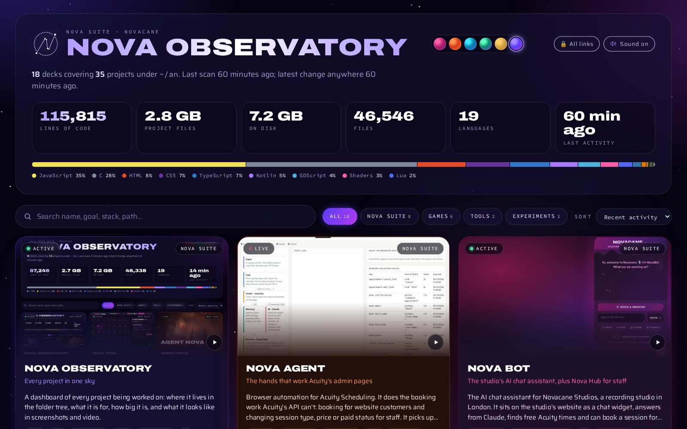
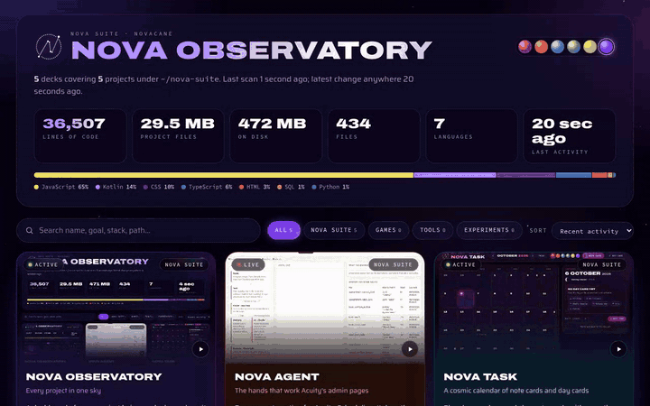
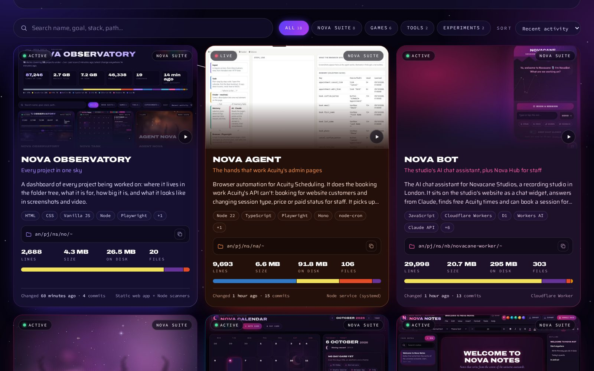
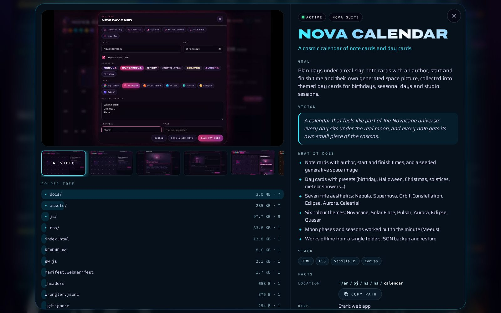
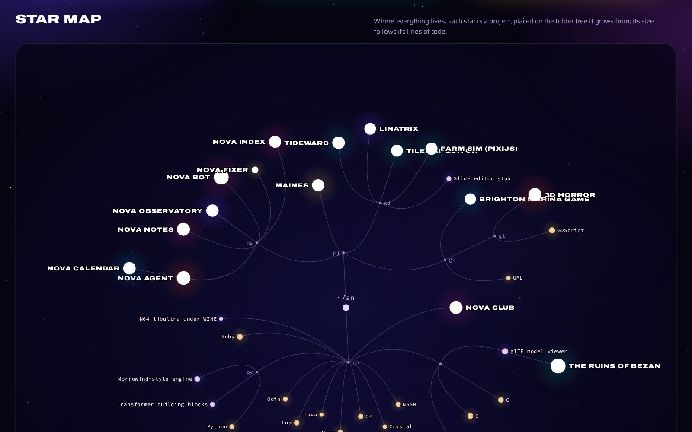
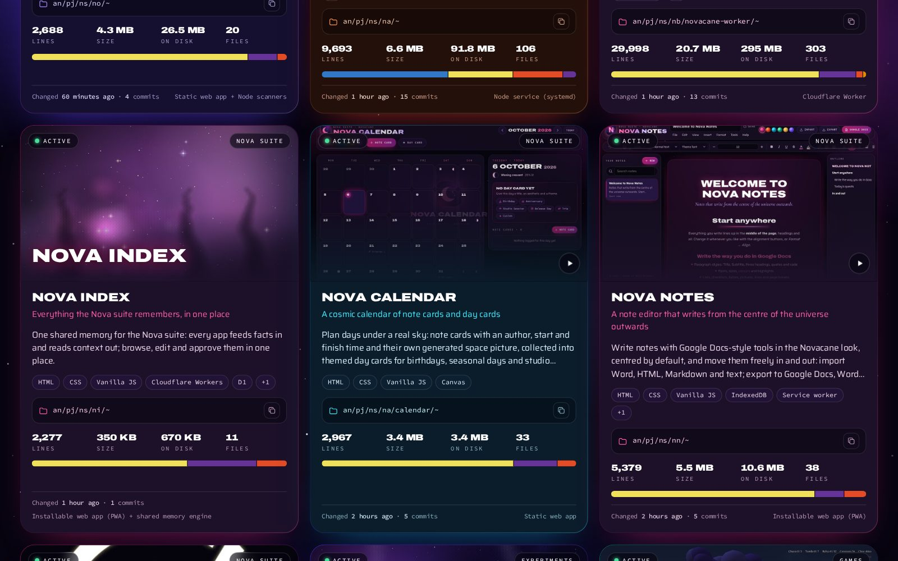
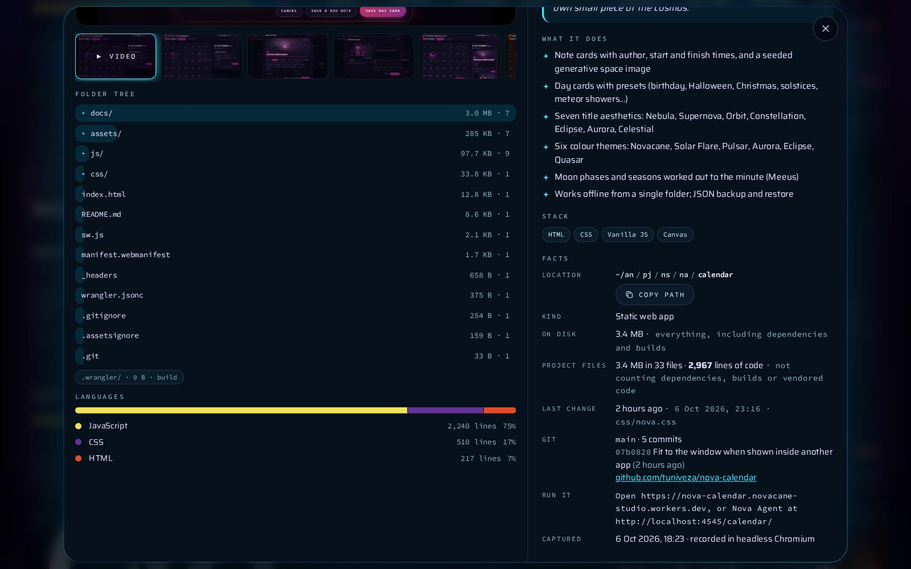
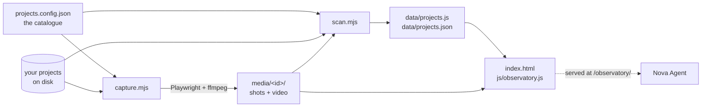

<div align="center">

# Nova Observatory

**Every project in one sky: a dashboard that measures your work on disk and shows it in screenshots and video.**

[](#run-it-locally)
[](#how-it-works)
[](#capture)
[](#capture)
[](https://github.com/tuniveza/nova-suite)



<sub>Always on inside Nova Agent at <code>/observatory/</code> · or open <code>index.html</code> anywhere</sub>

</div>

---

Nova Observatory is a dashboard of everything being worked on. It's kept true by scanning the
disk rather than by hand: one script measures every project, another opens each one in headless
Chromium and records screenshots and a short demo video, and a static page shows the lot as
project decks and a star map.

The screenshots here come from the studio's own catalogue: the Nova suite, plus games, tools
and experiments. They show project names, sizes and folder trees, and nothing personal.

## What's new

| | |
|---|---|
| 🔔 **Sound switch** | Soft cosmic sound effects on every press. The **Sound on / Sound off** switch beside All links turns them off and on. |
| 🔒 **All links** | A pill in the header that opens the password-protected page with every Nova suite address, live and testing. |
| ✦ **Served by Nova Agent** | Nova Agent serves it at `/observatory/`, so it's always on while Nova Agent is. |
| 🧠 **Nova Index** | The suite's shared memory now has its own deck. Nova Portal may join it later. |

## See it in action

<p align="center"></p>

<p align="center"><sub>Scroll the decks, then open one for the full story.</sub></p>

## What it does

Each project gets a **deck** showing:

- where it lives in the folder tree
- its goal and vision, and what it does
- its size on disk, project files, lines of code and languages
- git state and last activity
- screenshots and a demo video (or a generated cosmic cover)

And across all of them:

| | |
|---|---|
| **Totals** | Lines of code, project files, size on disk, files, languages and last activity, with a language bar |
| **Search, filter and sort** | By name, goal, stack or path; by category; by recent activity and more |
| **A detailed view** | Each project's video, screenshots, folder tree, languages and facts |
| **A star map** | The whole folder structure, with every project as a star sized by its lines of code |
| **Six colour themes** | Shared with [Nova Calendar](https://github.com/tuniveza/nova-calendar) and [Nova Notes](https://github.com/tuniveza/nova-notes) |
| **Sound effects** | The shared Nova suite sounds, with a switch in the header |

## Screenshots

<table>
  <tr>
    <td width="50%"><br><sub><b>Project decks.</b></sub></td>
    <td width="50%"><br><sub><b>A project up close.</b></sub></td>
  </tr>
  <tr>
    <td width="50%"><br><sub><b>The star map.</b> Each star sits on its folder; bigger stars have more code.</sub></td>
    <td width="50%"><br><sub><b>Nova Index</b>, the newest deck in the Nova suite row.</sub></td>
  </tr>
  <tr>
    <td colspan="2" align="center"><br><sub><b>Folder tree, languages and facts.</b></sub></td>
  </tr>
</table>

## Inside Nova Agent

[Nova Agent](https://github.com/tuniveza/nova-agent) serves this folder at **`/observatory/`**
(for example `http://localhost:4545/observatory/`) whenever it's running, so the Observatory is
always on there with the latest scan. Nova Agent looks for it next to itself, in `../no`.

## Sound effects

Every press makes a soft cosmic sound, made live with the Web Audio API (no sound files) and kept
quiet. The **Sound on / Sound off** switch beside **🔒 All links** turns them off and on, plays a
little chime when it does, and is remembered on each device. The same `js/sfx.js` makes the
sounds in Nova Notes and Nova Calendar.

## How it works



| File | Job |
|---|---|
| `projects.config.json` | Your catalogue. It holds what a scan can't know: each project's name, goal, vision, features, category, theme, and how to show it. **Add a project here.** Git ignores it; start from `projects.config.example.json`. |
| `scan.mjs` | Measures each project on disk. Writes `data/projects.json` and `data/projects.js`. |
| `capture.mjs` | Drives headless Chromium (Playwright) and ffmpeg. Writes into `media/<id>/`. |
| `index.html`, `css/`, `js/observatory.js` | The page. |
| `js/themes.js`, `js/cosmos.js`, `js/backdrop.js` | Shared with Nova Calendar: the colour themes, the generative space covers and the star backdrop. |
| `js/sfx.js` | The Nova suite sound effects, shared with Nova Notes and Nova Calendar. |

**What counts as what in a scan:**

- **On disk** is everything, from `du`.
- **Project files** and **lines of code** leave out:
  - dependencies and build output: `node_modules`, `build*`, `dist`, `.gradle`, `.godot` and so on
  - vendored third-party code: `lib`, `deps`, `glad`, `Libs`, `vendor`, `thirdparty`
  - anything listed under `exclude` in the catalogue, such as copied-in SDL or cglm headers
- Lines are counted only for code. Markdown, JSON, XML and config files don't count.

### Capture

**Capture modes** (`capture.mode` in the catalogue):

| Mode | What it does |
|---|---|
| `page` | Opens the project in Chromium and plays a short scripted demo, recording the screen. The project can be opened as a file, from a local static server (`serve`, with optional `mounts`), from the project's own Vite (`vite: true`) or from a `url`. The demo scripts are in `capture.mjs` under `SCRIPTS`. |
| `images` | Turns pictures already in the project into a Ken Burns slideshow video. |
| `none` | Shows a generated cosmic cover instead. |

**Safety:** during capture, every request that leaves the machine is blocked, except Google
Fonts, and every non-GET request is blocked too. A demo can type into a chat widget, but nothing
can reach a live service.

**Private projects:** projects marked `"private": true` are skipped unless you pass
`--include-private`. Use it for anything whose pages can show personal data (Nova Agent's
visualizer can show client names, so it's marked private in the example).

## Run it locally

```sh
git clone https://github.com/tuniveza/nova-observatory.git
cd nova-observatory
cp projects.config.example.json projects.config.json   # then point it at your projects
npm run scan                                            # a few seconds
npm run serve                                           # http://localhost:4610
```

Or open `index.html` straight from `file://`; it works without a server.

To refresh it:

```sh
npm run scan      # numbers only: sizes, lines, languages, git, folder trees
npm run capture   # screenshots + demo videos (a couple of minutes)
npm run build     # scan, capture, scan again
node capture.mjs nova-calendar nova-bot   # re-capture just some projects
```

Without a `projects.config.json`, both scripts fall back to the example catalogue and say so.
The example assumes the Nova suite repos are cloned side by side (`../nova-bot`,
`../nova-calendar` and so on); relative paths are resolved from the folder you run the scripts in.

**Needs:** Node 18 or newer. For capture, also `npm install` (Playwright is an optional
dependency), a Chromium (the system one at `/usr/bin/chromium` is used if present, otherwise run
`npx playwright install chromium`) and `ffmpeg` on your `PATH`.

## Configuration

There are no secrets or API keys. Everything lives in the catalogue:

| Key | What it's for |
|---|---|
| `root` | The top of your folder tree, for the star map |
| `projects[].id`, `name`, `tagline`, `category`, `theme`, `kind`, `stack`, `status` | How the deck looks and where it's filed |
| `projects[].path` | Where the project lives on disk |
| `projects[].goal`, `vision`, `features`, `run` | The words on the deck |
| `projects[].exclude` | Folders to leave out of the counts |
| `projects[].capture` | `mode`, `file` / `serve` / `mounts` / `vite` / `url`, `script`, `images`, `private` |
| `projects[].group`, `members` | A deck that gathers several small projects |

**What stays private.** Your catalogue, `data/` and `media/` describe every project on your disk
(names, paths, folder trees, git state, screenshots and videos), so `.gitignore` keeps them out
of the repository. Only the code, the example catalogue and the README images are published.

## Tests

There's no automated test suite. `npm run scan` prints a line per project with its line count
and timing, and `npm run capture` reports how many projects were captured, skipped or failed,
which is the quickest health check.

## Project layout

```
index.html                    the page
css/observatory.css           the styling
js/observatory.js             decks, detail view, star map, search, filter, sort and the Sound switch
js/themes.js, cosmos.js, backdrop.js   shared with Nova Calendar
js/sfx.js                     the Nova suite sound effects
assets/sigil.svg              the Nova sigil
scan.mjs                      measures every project
capture.mjs                   screenshots and videos (Playwright + ffmpeg)
projects.config.example.json  example catalogue (copy to projects.config.json)
data/, media/                 generated; ignored by git
docs/media/                   README images
```

## Part of the Nova suite

| Project | What it is |
|---|---|
| [nova-suite](https://github.com/tuniveza/nova-suite) | The Nova suite: an overview of every project |
| [nova-bot](https://github.com/tuniveza/nova-bot) | The website chat assistant, booking card and Nova Hub |
| [nova-agent](https://github.com/tuniveza/nova-agent) | The studio computer's helper; serves Nova Observatory at `/observatory/` |
| [nova-club](https://github.com/tuniveza/nova-club) | Members' Android app that shows the studio's busy times |
| [nova-calendar](https://github.com/tuniveza/nova-calendar) | A cosmic calendar of note cards and day cards |
| [nova-notes](https://github.com/tuniveza/nova-notes) | A note editor that writes from the centre outwards |
| **[nova-observatory](https://github.com/tuniveza/nova-observatory)** | This repo: a dashboard of every project, with screenshots and video |
| [nova-index](https://github.com/tuniveza/nova-index) | The suite's shared memory |

---

<p align="center"><sub>Made for <b>Novacane Studios</b> · All rights reserved</sub></p>
